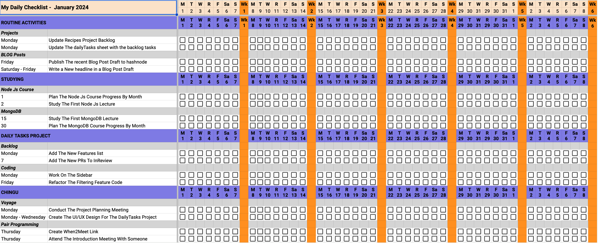

# A Daily Task Productivity Tool

This is my attempt at following the instructions for the productivity tool described for [Tier 1 of Chingu Voyage 47](https://github.com/chingu-voyages/voyage-project-tier1-dailytasks)

This is a sample layout


Tasks are grouped by Category, then within each Category, they are grouped by Activity.  The example data is given as a json file `tasks-example.json`, the beginning of which is show below.

```json
{
  "categoryName": "ROUTINE ACTIVITIES",
  "activityTypes": [
    {
      "activityName": "Projects",
      "Tasks": [
        {
          "taskName": "Update Recipes Project Backlog",
          "taskDescription": "",
          "days": [
            "monday"
          ]
        },
        {
          "taskName": "Update The dailyTasks sheet with the backlog tasks",
          "taskDescription": "add the filtering feature to Done",
          "days": [
            "monday"
          ]
        }
      ]
    },
    {
      "activityName": "Blog Posts",
      "Tasks": [
        {
          "taskName": "Publish The recent Blog Post Draft to hashnode",
          "taskDescription": "",
          "days": [
            "friday"
          ]
        },
        {
          "taskName": "Write a New headline in a Blog Post Draft",
          "taskDescription": "",
          "days": [
            "saturday",
            "sunday",
            "monday",
            "tuesday",
            "wednesday",
            "thursday",
            "friday"
          ]
        }
      ]
    }
  ]
},
{
  "categoryName": "STUDYING",
  "activityTypes": [
    {
      "activityName": "Node Js Course",
      "Tasks": [
        {
          "taskName": "Plan The Node Js Course Progress By Month",
          "taskDescription": "Set Up A Plan For The Next Month Of Node Js Learning",
          "days": [
            "1"
          ]
        },
```
